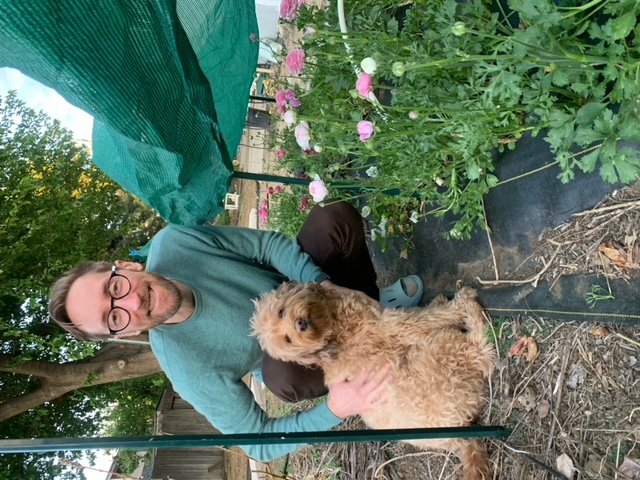

<figure>
    
</figure>

I used to be a philosopher of technology, last active as a postdoctoral associate at Duke University with the Program in Literature. My research and teaching span contemporary fiction and media, the technological nature of human experience, process philosophy, and phenomenology. My essays have been published in <i>Computational Culture</i>, <i>Process Studies</i>, <i>Angelaki</i>, and <i>Post-Cinema: Theorizing 21st-Century Film</i> (REFRAME 2016).

I also enjoy tinkering and making things. See my work at the humanities lab <a href="https://s-1lab.org" alt="S-1: Speculative Sensation" target="_blank">S-1: Speculative Sensation</a>. You can see my QMK (Quantum Mechanical Keyboard) code on GitHub for a few ortholinear keyboards: Boardsource's <a href="https://github.com/DavidRambo/qmk_firmware/tree/master/keyboards/boardsource/lulu/keymaps/davidrambo" target="_blank" alt="Lulu QMK" target="_blank">Lulu</a>, the <a href="https://github.com/DavidRambo/qmk_firmware/tree/master/keyboards/crkbd/keymaps/davidrambo" target="_blank" alt="Corne QMK" target="_blank">Corne</a>, OLKB's <a href="https://github.com/DavidRambo/qmk_firmware/tree/master/keyboards/planck/keymaps/davidrambo" target="_blank" alt="Planck QMK">Planck</a> and <a href="https://github.com/DavidRambo/qmk_firmware/tree/master/keyboards/preonic/keymaps/davidrambo" target="_blank" alt="Preonic QMK">Preonic</a>, and the <a href="https://github.com/DavidRambo/qmk_firmware/tree/master/keyboards/xd75/keymaps/davidrambo" target="_blank" alt="XD75 QMK">XD75</a>.

