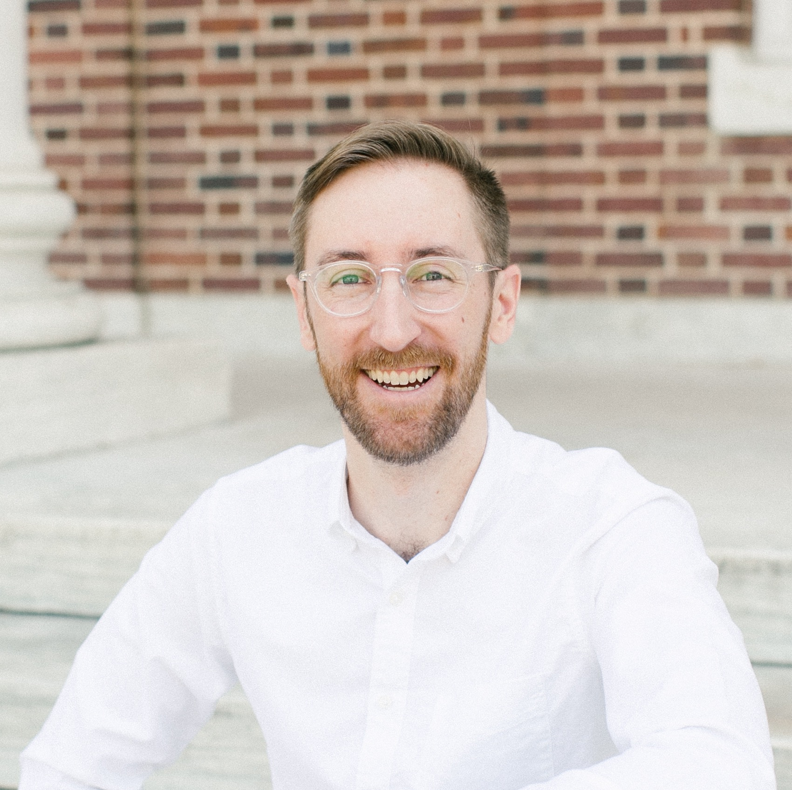

<figure>
    
</figure>

Welcome! I'm David Rambo, a humanities educator, tech enthusiast, Dungeon Master, and baker. The blog is a clearing ground for reflections on what I've been reading and playing. There are also a bunch of conference talks I've delivered, mostly at SLSA while I was a graduate student at Duke.