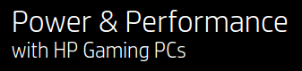
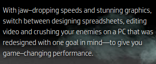

OMEN is HP's line of gaming hardware, software-based services, and complementary accessories. In this article, I assess the design of both the store and informational websites that represent HP OMEN. First, I analyze the main store page, then I address the informational site (what I'm calling the OMEN Homepage), and lastly I consider an additional, elusive store page more suitably stylized after the OMEN homepage.

## Getting There

When searching for HP OMEN, the first results on both Google and DuckDuckGo are for the HP Store page. This is because it is an advertisement. The first non-ad result DuckDuckGo provides is the information site, while Google provides the store.

I think this may be a mistake. The information site, as I will show, is both a stronger introduction to the brand and a more pleasant exploratory process. Moreover, it features links to the store page, so . 

## The Store



The store greets the potential customer with a compelling juxtaposition of comforting white space and a banner that pops. Since I am interested solely in how OMEN presents itself, I will focus on the banner.

### Colors
Let's begin with the color palette. On the leftmost third, the banner's basic color scheme inverts that of the rest of the page from black text on white background to white on black. This accomplishes both a continuity with the rest of the store as well as a contrast with HP's work-oriented flagship products. In the center, the neon blue, green, and purple on the large monitor effect a sense of liveliness and action. They also downplay the subtle red LEDs on the Desktop tower---a welcome change from the long-reigning black and red aesthetic associated with gamer gear. (Unfortunately, this color scheme continues to dominate many of the accessories, see here.) Moving to the rightmost third, the strong violet light and secondary blue-grey further establishes the liveliness of the presentation. 

### Elements
Next, let's take a closer look at the elements.

The 65" marker at the top right of the monitor is an odd detail, probably missed when composing the image. Next to the Desktop tower and laptop, the screen clearly 

Depending on the viewer's tastes, the horizontal streak of yellow encircling the top of the laptop (which clearly shows Windows 10 as its OS) may work toward the scene's dynamism, or it could clash with the amorphous softness of the smoke. The only other yellowish element is the table, which serves as a physical and aesthetic basis for the OMEN products on dispaly. Unlike the smoke's extension of the screen's colors beyond the monitor's frame

### Text
Fortunately for the banner, its weakest aspect is also the most easily overlooked: its text. Let's take it one line at a time.

If this is all the potential customer reads, which is likely, then they know the essential thing, that they're in the right place for gaming hardware. Could it be improved upon? While "Power & Performance" sounds good---alliterative word pairs always capture my attention---it is redundant. Performance of a PC derives from computing power relative to the application running. Granted, a graphically gorgeous game can perform well on low-powered hardware thanks to optimization, but that sort of consideration is too nuanced for the purpose at hand. With that in mind, however, the redundancy should not be seen as a failure but an opportunity to come up with a more descriptive, encompassing alternative set of properties. For what it's trying to accomplish, you could do a lot worse than "Power" and "Performance" on the top line.

A nicely diminished size in typeface says what it needs to say without overwhelming. There is no chance the user would forget that they're looking at HP's line-up, but that's not at issue. Repetition helps to cement in the user's mind an association of well-made gaming PCs with HP.

As with the heading, line number one of the body text pushes the main aspect: a PC so performant it leaves an impression on your body. The OMEN user's jaw will drop; they will be stunned. Anyone who has booted up a new rig running a benchmark game knows the feeling. 

Beyond the first line, the sentence runs into a number of problems haivng to do with word order and typography. We can get the latter out of the way quickly. 

#### Typographical Errors
The list ("designing spreadsheets, editing video and crushing your enemies") lacks an oxford comma. This is fine in and of itself---the AP Style Guide omits them---but the OMEN Homepage, as we'll see in a moment, uses them. (Also, I am partial toward the oxford comma because it prevents amphibolous mergers of listed items.) 

The em-dash in "...one goal in mind---to give you game-changing performance" ought to be a colon. An em-dash signals either an aside that is too seemless to be placed within parentheses or a definitive break with what came before it in the sentence. For examples of both an em-dash aside and a parenthetical aside, see the preceding paragraph---and here's an example of using an em-dash to break with a sentence! By contrast, a colon can be equated with an equal sign. It indicates that what is to follow will be what precedes it. In this case, the colon would signal that the "one goal in mind" is "to give you game-changing performance."

#### Wonky Word Order
Not everyone cares for that level of syntactical specificity, but I suspect that this close reading will carry more weight. What, according to the sentence, does an HP Gaming PC's jaw-dropping speeds and stunning graphics enable?

> With jaw-dropping speeds and stunning graphics, switch between...

To switch between applications! Huh. That's pretty underwhelming. Also, for a product that features Intel CPUs, it's counterintuitive. AMD's Ryzen line has been dominating the processor field in terms of multitasking performance.

Okay, so let's look past the central verb of choice as an unfortunate side-effect. After all, the main thrust of the sentence comes through in the applications listed. That's where expensive hardware will really shine.

> ...switch between designing spreadsheets, editing video and crusing your enemies...

## The OMEN Homepage

Of the three webpages analyzed, this is the strongest. The header from the rest of HP's website remains at the top, but it does not stick when scrolling down. This allows the OMEN content to speak for itself as a fully fledged subdomain of the HP brand.

When selecting the "SHOP" link in association with any of the family of products, it delivers the user to the store page. 

## Which Store?

These two websites are oddly connected. When using the drop-down menu "Desktops" to select "Gaming", it transports the customer away from the store to the informational site just discussed. Should the user then select a "SHOP" link associated with any of the products in the OMEN family, they are returned to the store page whence they came.

There is, however, a second store page for OMEN products, which can be accessed via the main store page by clicking "Desktops" at the top. Yes, this is the very same "Desktops" menu item that, when hovered over with the cursor, reveals the drop-down menu used to access the OMEN homepage. Clicking it takes the user to a catalog of Desktop PCs, this one being less crowded than the main store page. 
