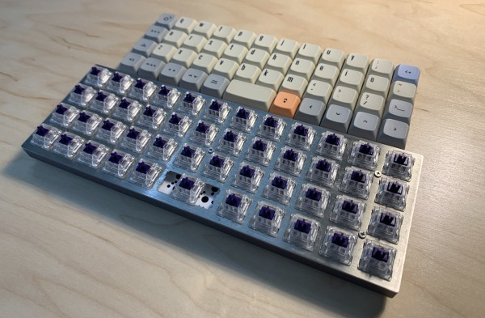

### Building, Coding, Typing

Under review for Fall publication in _Computational Culture_

This article describes the technoculture of custom mechanical keyboards, with an emphasis on the author’s experience of building, programming, and relearning to type Colemak on a non-standard mechanical keyboard called the Planck.
The Planck is not merely a technical _object_ but a _metonymy_ for a technical activity.
Drawing on Gilbert Simondon’s philosophy of individuation and technical objects, I propose that technology is first and foremost a process that modifies phenomena by intentionally intervening in the media that condition them.
Human experience and cultural meaning are no less integral to technology’s purposeful coordination of heterogeneous processes than the physical and electronic components.
With building, coding, and typing on the Planck as a guide, the article argues that proprioceptive preference, coded customization, visual taste, materials quality, consumer fads, community belonging, and personal expression all factor into the individuation of the mechanical keyboard technological activity.
In particular, it criticizes both Simondon’s theory of the "technicity" of technical objects and Wolfgang Ernst’s "media archaeology" for keeping factors other than physical operations outside the domain of technical media.
Ultimately, this article contributes to Eric Schatzberg’s work on the technology concept.
Its formulation of technology as its own individuation intervenes between predominant media theories that rely on a either a paradigm of human-tool prosthesis or the materiality of nonhuman actors to explain the nature of technology. 

### Contact Traces: On the Creative Technology of Videogame Gore

Forthcoming in *Discourse: Journal for Theoretical Studies in Media and Culture*, 42.3 (Fall 2020).

“Contact Traces” proposes a formal aesthetics of videogame violence focused on how graphical gore mediates between the disparate elements of gameplay. Rather than solely representing realistic violence, gore traces causal relations between program and player, celebrates the singular execution of gameplay, and indexes the combinatorial potentiality of the game’s structure. This article both resists the tendency to interpret game violence in terms of realism and argues against critics who frame screen violence as immediate and experientially intense. Instead, the analysis of gore as an abstract form foregrounds the reflective activity involved in gameplay. Through such examples as *DOOM*, *Hotline Miami*, *Defender*, and many others, the piece shows that gory forms contribute to a game’s creative self-presentation.

### Interstitial Life and the Banality of Novelty in Whitehead's *Process and Reality*

<a class="pub-link" href="https://www.jstor.org/stable/10.5406/processstudies.47.1-2.0026#metadata_info_tab_contents" target="_blank"><i>Process Studies</i> Vol. 47, No.1-2 (2018): 26-46</a>

Alfred North Whitehead’s metaphysical conception of life in <i>Process and Reality</i> is elucidated. The article is about neither biology nor psychology, but about how Whitehead’s view of interstitial life might account for these scientific disciplines’ range of phenomena and originality more generally. Whitehead’s view of the universe as always novel but rarely original will be clarified, as will the role of eternal objects through the category of conceptual reversion.

### Of Fear and Exaltation: The Sublime Autonomy of Finance

<a class="pub-link" href="https://www.tandfonline.com/doi/abs/10.1080/0969725X.2016.1182728" target="_blank"><i>Angelaki</i> 21.2 (2016): 83-98</a>

This essay considers the political economic ideology in recent popular cinematic depictions of finance in terms of Immanuel Kant’s aesthetics of the sublime. I give a sustained reading of how the Kantian sublime operates in Neil Burger’s film <i>Limitless</i> (2011). By subordinating both the technics of neuro-augmentation and economic contingency to an innate human reason, the protagonist shows audiences what it might mean today to experience sublimity – but not without hinting at a latent anti-Kantian fissure that would reorient us against this bourgeois discourse.

### The Error-Image: On the Technics of Memory

<i>Post-Cinema: Theorizing 21st-Century Cinema</i>, edited by Julia Leyda and Shane Denson (REFRAME Books 2016).  
This collection is intended for classroom use and is freely available <a href="http://reframe.sussex.ac.uk/post-cinema/" target="_blank" title="reframe.sussex.ac.uk/post-cinema/">here</a>.

What is it to experience a fragment of time in its pure state? Is such an aesthetic really possible, as Gilles Deleuze assumes in <i>Cinema 2</i>? How do film and electronic visual media either depict or instill such experience? In reply to these questions, this book chapter proposes an aesthetic relation between viewer and temporal object: the error-image. Through numerous examples from visual culture, I synthesize Henri Bergson's philosophy of memory with Bernard Stiegler's technological phenomenology. Technics, on one hand, help to materialize the former's metaphysical dualism and, on the other hand, transgress the latter's clearcut stratification of technical recording from living memory.

