OMEN is HP's line of gaming hardware, software-based services, and complementary accessories. In this write-up, I assess the design of both the store and informational websites that represent HP OMEN. First, I analyze the main store page, then I address the informational site (what I'm calling the OMEN Homepage), and finally I consider an additional, elusive store page more suitably stylized after the OMEN homepage.

### Getting There

When searching for HP OMEN, the first results on both Google and DuckDuckGo are for the HP Store page. This is because it is an advertisement. The first non-ad result DuckDuckGo provides is the information site, while Google provides the store.

I think this is the wrong marketing decision. The information site, as I will show, is both a stronger introduction to the brand and a more pleasant exploratory process. Moreover, it features prominent links to the store page, so the potential consumer will both be likely to end up at the shop and feel like more of an agent in making a possible purchase. 

## The Store



The store greets the potential customer with a compelling juxtaposition of comforting white space and a banner that pops. Since I am interested solely in how OMEN presents itself, I will focus on the banner. Know, though, that I will address the significant challenge of getting from this page to the OMEN homepage in the third section: ["Which Store?"](#which-store)

### Colors
Let's begin with the color palette. On the leftmost third, the banner's basic color scheme inverts that of the rest of the page from black text on white background to white on black. This accomplishes both a continuity with the rest of the store as well as a contrast with HP's work-oriented flagship products. In the center, the neon blue, green, and purple on the large monitor effect a sense of liveliness and action. They also downplay the subtle red LEDs on the Desktop tower---a welcome change from the long-reigning black and red aesthetic associated with gamer gear. (Unfortunately, this color scheme continues to dominate many of the accessories, see here.) Moving to the rightmost third, the strong violet light and secondary blue-grey further establishes the liveliness of the presentation. 

### Elements
Next, let's take a closer look at the elements.

The assembled products provide a representative sample of the OMEN brand. Although I suspect that desktops and laptops are the main products, the centerpiece is rightly a humongous monitor. Its immersiveness comes through in its containing a full person. That the person on display is in turn wearing a VR headset does not interfere with the presentation. Rather, it's saying to the store visitor that HP's OMEN products will power a VR-level experience regardless of whether they have a VR setup. This is high praise because a person wearing a VR headset typically looks silly.

The 65" marker at the top right of the monitor is an odd detail, probably missed when composing the image. Next to the Desktop tower and laptop, the screen clearly has impressive dimensions. If possible, it should be removed so as to preserve the fantasy of a computer that transports the user into cyberspace.

Depending on the viewer's tastes, the horizontal streak of yellow encircling the top of the laptop (which clearly shows Windows 10 as its OS) may work toward the scene's dynamism, or it could clash with the amorphous softness of the smoke. It seems to be of a piece with the dual yellow bands curving around the edge of the table. The viewer would be forgiven for mistaking those yellow lines *as* the table. After observing the image for quite a while, I finally recognized the implied continuity between the sets of yellow streaks.

### Text
Fortunately for the banner, its weakest aspect is also the most easily overlooked: its text. Let's take it one line at a time.

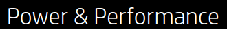

If this is all the potential customer reads, which is likely, then they know the essential thing, that they're in the right place for gaming hardware. 

Could it be improved upon? While "Power & Performance" sounds good---alliterative word pairs always capture my attention---it is redundant. Performance of a PC derives from computing power relative to the application running. Granted, a graphically gorgeous game can perform well on low-powered hardware thanks to optimization, but that sort of consideration is too nuanced for the purpose at hand. For what it's trying to accomplish, you could do a lot worse than "Power" and "Performance" on the top line. Nonetheless, there is an opportunity to come up with a more descriptive, encompassing alternative pair of properties.

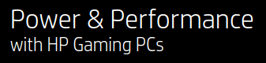

A nicely diminished size in typeface says what it needs to say without overwhelming. There is no chance the user would forget that they're looking at HP's line-up, but that's not at issue. Repetition helps to cement in the user's mind an association of well-made gaming PCs with HP.

As with the heading, line number one of the body text pushes the main aspect: a PC so performant it leaves an impression on your body. The OMEN user's jaw will drop; they will be stunned. Anyone who has booted up a new rig running a benchmark game knows the feeling. 

Beyond the first line, the sentence runs into a number of problems having to do with diction and typography. 

#### Wonky Word Choice
What, according to the sentence, does an HP Gaming PC's jaw-dropping speeds and stunning graphics enable?

> With jaw-dropping speeds and stunning graphics, switch between...

To switch between applications! Huh. That's pretty underwhelming. Also, for a product that features Intel CPUs, it's counterintuitive. AMD's Ryzen line has been dominating the processor field in terms of multitasking performance. 

Let's look past the central verb of choice as an unfortunate side-effect of writing a sentence that lists appealing applications. After all, that's where expensive hardware will really shine.

> ...switch between designing spreadsheets, editing video and crusing your enemies...

Hell yeah! I cannot wait to overclock my new GPU and scroll through this spreadsheet at 240hz.

Either HP got its enterprise and gaming wires crossed or it is very much invested in the subset of gamers who do, indeed, utilize spreadsheets to optimize their loot grinding and then edit video guides for YouTube. Both strike me as odd choices. Perhaps there is marketing data to support targeting a broad consumer base of gamers as aspiring content creators.

*If the "one goal" of this PC is "game-changing performance," then games should be given pride of place over spreadsheets and video editing.*

And of minor note, "redesigned" should probably be "designed."

#### Typographical Errors
The list ("designing spreadsheets, editing video and crushing your enemies") lacks an Oxford comma. This is fine in and of itself---the AP Style Guide omits them---but the OMEN Homepage, as we'll see in a moment, uses them. (Also, I am partial toward the Oxford comma because it prevents amphibolous mergers of listed items.)

Next up, and more importantly, the em-dash in 

>...with one goal in mind---to give you game-changing performance.

ought to be a colon. An em-dash signals either an aside that is too seamless to be placed within parentheses or a definitive break with what came before it in the sentence. For examples of both an em-dash aside and a parenthetical aside, see the preceding paragraph---and here's an example of using an em-dash to insert a break within a sentence.

By contrast, a colon can be thought of as an equal sign. It indicates that what follows will exemplify or expand upon what precedes it. In this case, the colon would signal that the "one goal in mind" is "to give you game-changing performance."

### Improve It

Here's my first-pass revision:

> Experience your games like the developers intended: on a PC designed for jaw-dropping speeds and stunning graphics.

It's a straightforward exhortation rather than a misguided list. The focus is on the personal. "Experience your games" covers a much wider gamut of play than does the phrase "crushing your enemies." The potential consumer is invited to play their games, whatever they may be, under optimal conditions. An HP Gaming PC becomes an ideal conduit between developer intention and gamer experience.

## The OMEN Homepage

**Note**: HP has since updated this webpage and given it its own domain at omen.com (before, it had been https://www8.hp.com/us/en/gaming/omen.html). It is now much more active, with each portion loading in as you scroll down. On a Macbook Air and iPhone XR, these images and styled elements stutter a little. While the title section's new look is appealing, overall the webpage feels overly busy, cluttered, and frankly less performant than the products on offer.

Here is a link to the original OMEN Homepage, via the Internet Archive's Wayback Machine.

### The Recently Replaced Banner


The sunburst color gradient is a great choice. It is vibrant and distinguishes OMEN from HP's appropriately staid corporate profile. I also enjoy how refreshing it is compared to the faux-edgy red-on-black "hardcore gamer" aesthetic. The white vector graphics behind the laptop further contribute to the fun of the banner.

Displaying a laptop is another strong choice. A desktop tower could come off as an imposing black box; whereas a laptop offers a more dynamic image. Its subtle angle away from flat gives it the appearance of flight, of a flexibility that crosses over from a laptop's mobility to a player's in-game adaptability. Also, showing the laptop in profile from behind directs the viewer's focus to the hardware itself rather than whatever happens to be on screen. And there is something on screen---we can be certain of this thanks to the subtle blue glow emanating from the unseen display. This avoids the corny fake-game graphics seen in marketing for gaming monitors. Instead, we are presented with the hardware's potential to run anything.

### The New Banner

First, the old HP store header has been replaced with an OMEN-specific header:

This allows the OMEN content to speak for itself as a fully fledged subdomain of the HP brand. I would have it stick when scrolling down, at least for larger screens, or have a hamburger button for an expandable menu. Currently, the header disappears with the slightest downward scroll. I missed it the first time I visited. 

As of April 10, 2020, the "LAPTOP" button does not work. 

Otherwise, I like it.

Now, onto the banner images.

A sense of unfamiliarity is baked into the banner's design, and it hurts the experience. As much as I admire the blending of follow-through links with the design, it is not at all intuitive because so many of the elements *are not links*. I encourage you to go to the webpage and time yourself to see how long it takes to get oriented.

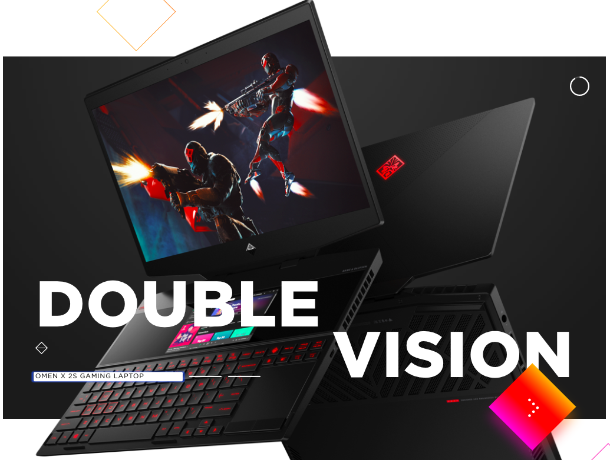

This first image retains the dynamic presentation of a laptop, but opts to reveal the screen with corny faux-game graphics. This is an understandable trade-off in order to show the secondary screen built into the base of the laptop.

Again, I encourage you to view the website yourself, as the smaller screenshots shown here significantly minimize the disorienting experience.

The foregrounding of squaers in the second banner image accentuates the confusion between interactive and non-interactive elements:

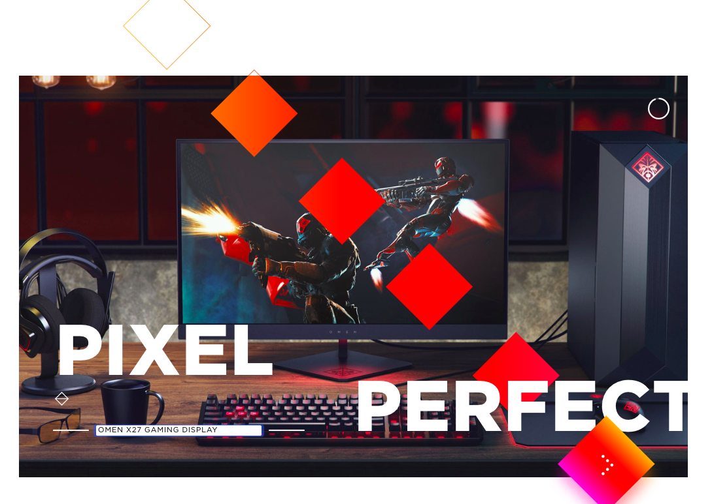

The third image, of the sponsored streamrs, expresses a friendly representation of the diverse consumer base OMEN seeks to develop:

My recommendation is to eliminate the follow-through link in the bottom-right-hand square. There are enough paths by which to learn more about the brand and its products. Also, remove the paired triangles just above the three white bars. I think the bars will be more readily recognizable as buttons to change the banner's image without the stylistic element so near.

### Fading Into Frustration

Initially, the elements roughly fade-in, which is particularly the case for the diagonal arrangement of squares. To be clear, I think the swapping between foreground and background in the sequence of images is well executed. My concern is that the roughness of the fade-in becomes a common refrain due to the site's excessive use of it. 

It reminds me of Apple's product pages, which are seamless in this effect but also offer a quick escape toward a maore condensed and straightforward itemization of product specifications. One of the crucial differences is that Apple's product showcases tend to give the impression of scrolling in place: the image and textual elements change while the border remains static.

Likewise, when clicking on an option in the OMEN header, let's say "DESKTOP", I expect more information than a small image of the OMEN Obelisk and yet another button for more details:

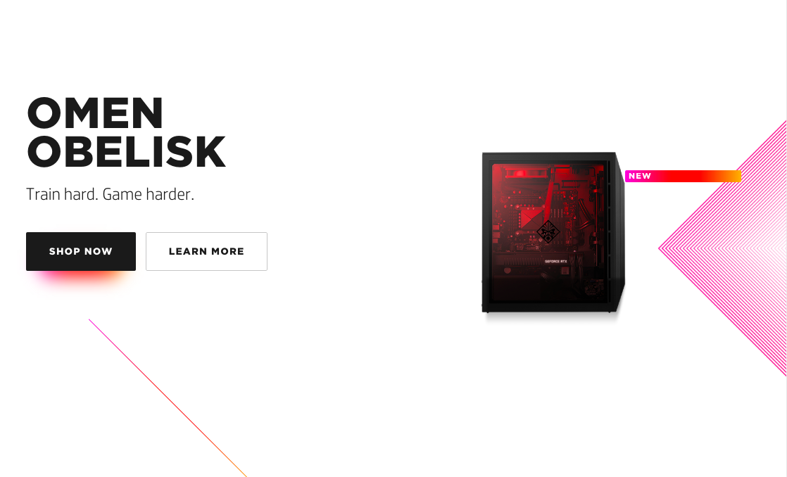

As I scroll down, the page is blank white space for too long before populating with two option from which to choose:

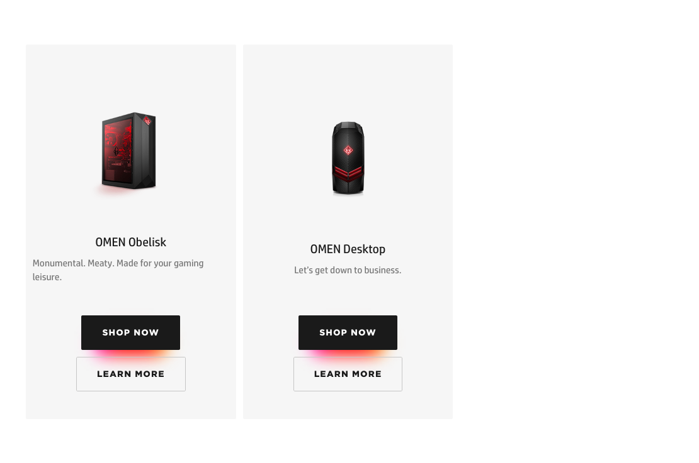

The amount of work the user must perform—measured in attentional effort, clicks, and scrolling—in order to find out about OMEN exceeds what I would accept as a combination of information and stylistic presentation. The repetetion of "SHOP NOW" and "LEARN MORE" buttons is symptomatic of this excess. 

*It is bloated.*

## Which Store?

It is difficult to determine whether these two websites are at all connected. When viewing the HP Store page in a very wide browser window, there are a series of drop-down menus:

In a smaller browser, this is replaced with the typical hamburger-style button. That's fine, but it's easy to miss because there are already plentiful options for links. This is a problem because it is the only way I could find to arrive from the Store page to the OMEN homepage.

By the way, selecting the hamburger-button-menu removes the cursor from view and manifests its placement by way of color-changing text effects. This disorients the users. Just keep the cursor visible!

Note the blue "DESKTOP":

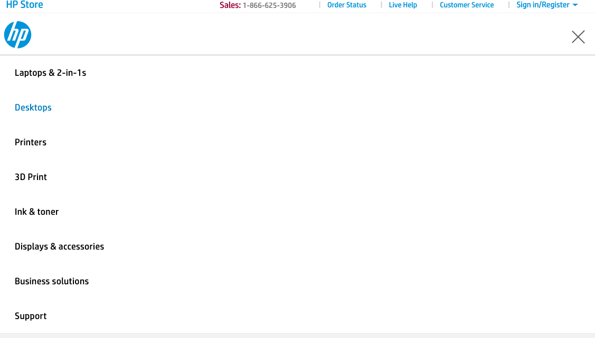

Hovering the cursor over "Desktops" allows one to select "Gaming", which transports the customer away from the store to the informational site just discussed. Should the user then select a "SHOP" link associated with any of the products in the OMEN family, they are returned to the store page whence they came.

There is, however, a second store page for OMEN products, which can be accessed via the main store page by clicking "Desktops" at the top. Yes, this is the very same "Desktops" menu item that, when hovered over with the cursor, reveals the drop-down menu used to access the OMEN homepage. When viewed through the smaller-window hamburger menu, this presents as its own, secondary "Desktops" button: 

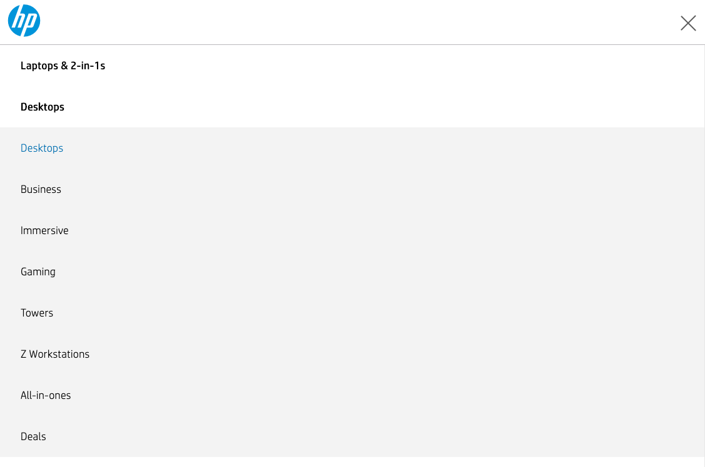

Clicking it takes the user to a catalog of Desktop PCs, this one being less crowded than the main store page. 

In it, you can find a picture that links to the old OMEN homepage.

On a smaller screen:

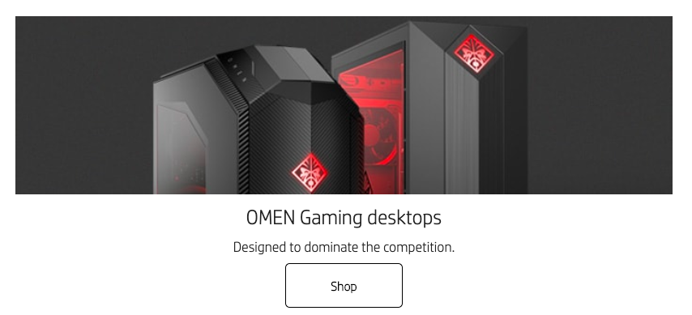

And a larger screen:

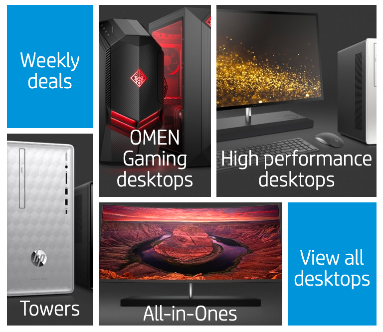

It brings the user to the following:

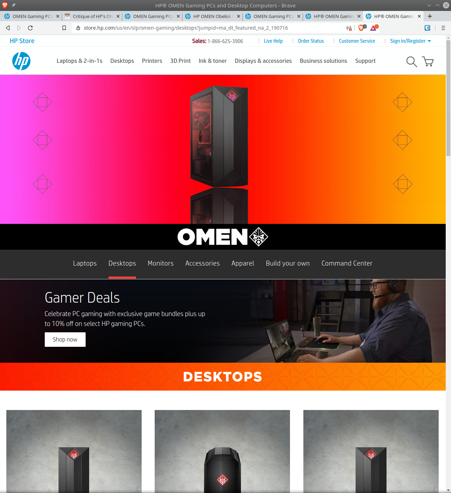

I prefer this blended store-with-branding page to the new OMEN Homepage. It has the color schemes that set OMEN apart from the rest of HP and provide some flair. Crucially, it maintains a higher density of information than the newer page *without feeling busy and slow*. Consider the entry for OMEN Laptops.

## Conclusion

Whew! That was a lot to get through. And yet so much was left out of this analysis. I pointed out a variety of problems with HP's *several* PC websites, and they can be summed up as excessive redundancy. From the mottos (I didn't get to "Play harder. Play Smarter.") to the many intermediary stages when navigating the sites to the overdesigned new omen.com, HP's OMEN webpresence too often disregards Steve Krug's titular admonishment to web designers: "don't make me think."

Improvement can be easily arrived at, I think, by simplifying at all levels. 

#### This means consolidating websites. 

While the redundancy of multiple entrypoints to buying OMEN products might seem like a way to ensure that consumers get to a point-of-sale, I argue that it increases the likelihood of confusion and frustration when trying to find out what it is they would purchase. 

#### This means streamlining the experience. 

With regard to the OMEN homepage, eliminate the majority of visual effects and keep the header stuck to the top of the browser for easy navigation. In addition to what was mentioned above, I recommend removing the drop-down buttons in the "Technical Specifications" sections of the Gaming PCs as well. The skeleton for the OMEN web presence is already solid. Unfortunately, the layers of effects, menus, imbalanced white space, and disjointed websites will probably exhaust the user's patience.