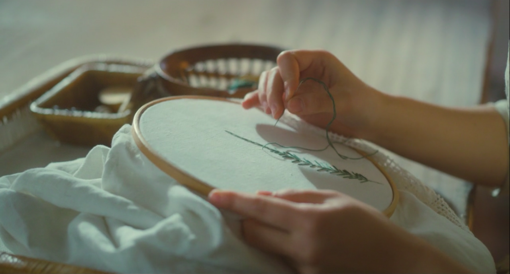
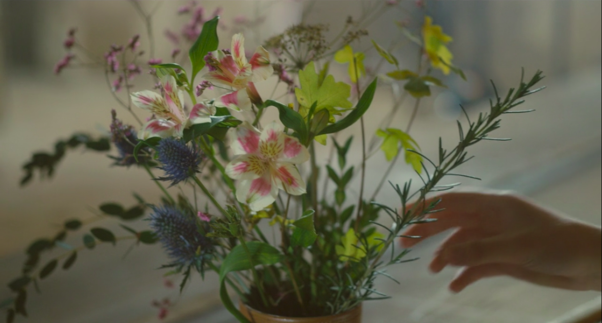
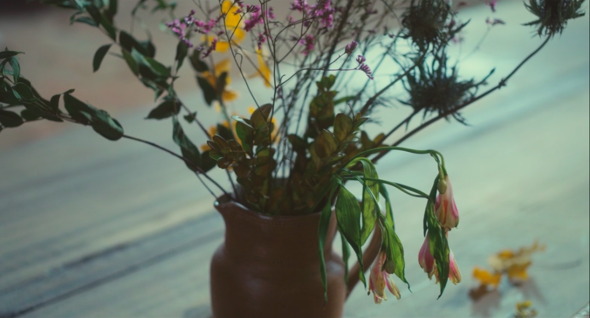
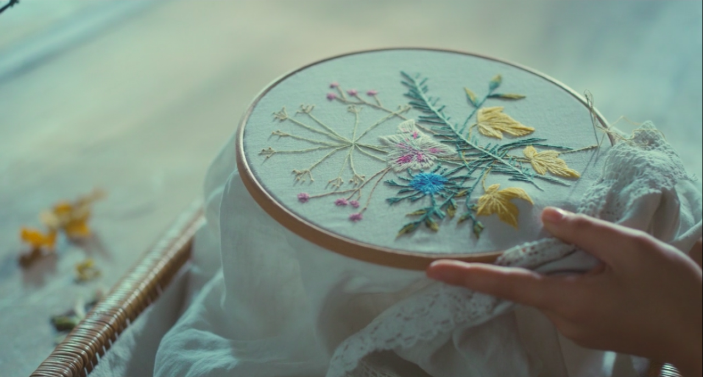

> “Do all lovers feel as though they are inventing something?”

This statement must be a question. Héloïse feels the originality of love all the while acknowledging its serial existence. She knows herself to be caught in a repetition that is always novel. One is never the first lover. The painter Marianne has known love, as has Sophie the kitchen maid. Love, like any truth, compounds with its prior realizations. Yet it is no less original for that. 

The following line about knowing what gestures to make must be an observation of the invention now underway. Héloïse regards her hands, adopting the poet’s gaze—again and not for the last time—as the painter has shown her. 

When Héloïse is first on screen in the flesh, she runs ahead, not looking back. She plays the role of Orpheus, before we know it. So we know the desire for Orpheus to turn back; we know, as Marianne puts it, the choice of the poet to side with memory and, thus, with the eternal idea of Love. We then recognize Héloïse’s imperative, “Rétourne-toi!”, when she sees Marianne for the last time, not as either Eurydice’s desire or even Orpheus’s choice but as a demand made by the eternal on the temporal.

The two apparitions of Héloïse in her white gown were not so much ghostly hauntings as they were signs of the finitude of love—*this* love—but signs as well of the eternity of Love that may be realized by art. (Keep in mind that lovers *invent*, as in: the act of love is itself an art in the older, capacious sense of poeisis as making. It is of human origin and therefore is contingent as opposed to necessary.) On one hand, the painter faces the inevitability that there will be a last glance. Héloïse’s mother will return, the portrait will have been finished, and their business will conclude. Hence the film represents this impending closure and return to temporal normalcy (“temporal” as in both worldly and linear temporality) with Héloïse in the white marriage gown her mother is presently bringing home. 

On the other hand, this is also Héloïse’s Eurydice-like image, which expresses the opposite of the temporal: the eternal, the universal, and above all the poetic presence (or even capture) of Love. Does, then, the painter know in advance that she will make the poet’s choice? This is the right question but from the wrong perspective. Héloïse, I think, plays the role of agent. (When reading Ovid, she proposes that Eurydice asked Orpheus to turn.) Again, she is not Orpheus, as she was when the camera first follows her to the cliffs. She personifies poiesis as a power that bridges the finite closure of love’s temporal re-invention with the eternal, indefinite idea of Love. 

Of the many artistic repetitions, my mind grabs hold of the clearest, though far from the most emotionally impactful or arresting, sequence: Sophie's embroidery.

First, from thread to sprig:

Then, from wilted object to preserved artifact:

(From *Portrait de la jeune fille en feu* (dir. Céline Sciamma). Screenshots taken by [ladyonfire28.tumblr](https://ladyonfire28.tumblr.com/post/613948727807410177/luthienne-portrait-of-a-lady-on-fire-2019-dir).)