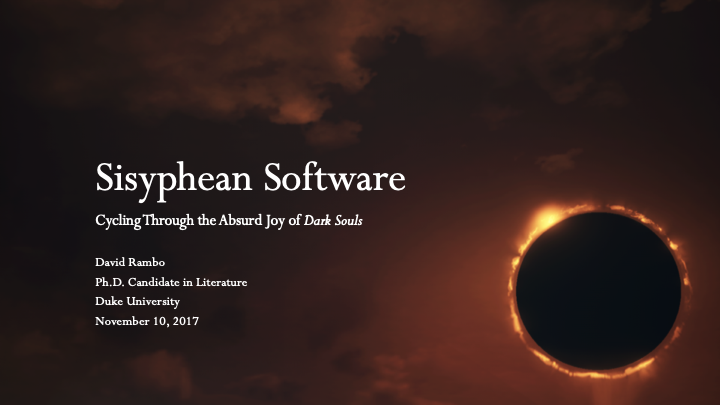

## Introducing *Dark Souls*

*Dark Souls* is a challenging, dark fantasy, action role-playing game series with ambiguous environmental storytelling and multiplayer interaction built into the game’s fiction. The difficulty of developer From Software’s *Souls* games, which also include *Demon Souls* and *Bloodborne*, derives from a philosophy of game design that harkens back to the medium’s earlier eras: its mechanics are exacting, but are considered fair insofar as enemies telegraph their movesets, and the player must perform their own actions very deliberately. Narrative in *Dark Souls* must almost entirely be pieced together through detective work, online collaboration, and speculation. NPC dialogue is sparse and often cryptic, typically requiring additional lore to understand. For this talk, a general sense of the lore will do, so I will not be engaging in any theory crafting of my own.

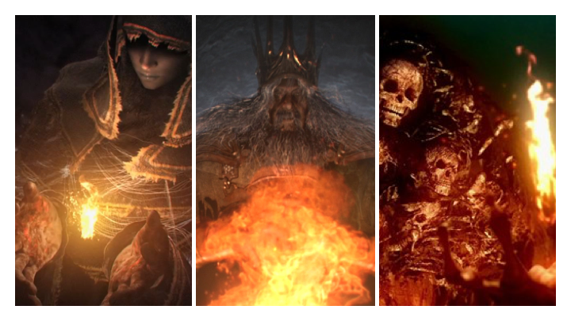

It’s not entirely clear to me when and where each of the three *Dark Souls* games take place in relation to each other—at least not chronologically. There is, however, a more definite sense of their relation to the cyclical forces at work in their world. According to the *Dark Souls* mythos, the First Flame was stolen from the gods, divvied up into several Lords’ Souls, and used to defeat the immortal dragons and to establish earthly civilizations. To maintain this state of affairs, the Flame must be periodically renewed by a Lord. This is alternately called linking the fire and inheriting the flame. As an Age of Fire fades, the inhabitants, whether human, giant, or monstrous creature, come to bear the curse of the Dark Sign, which prevents death.

Eventually, many go hollow and lose their Humanity---a resource in the first two games. 

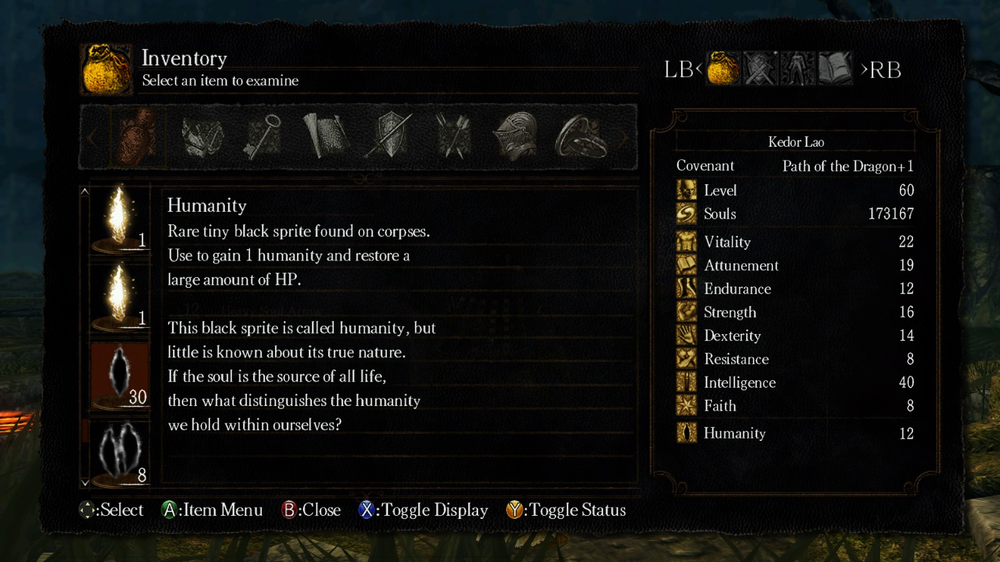

The player’s character is also an Undead, but is among those Undead bound to the Flame and who can therefore take up the task to link the fire. This requires defeating and obtaining the Lord Souls and then choosing either to propagate the Age of Fire or to forsake it and usher in an Age of Dark. 

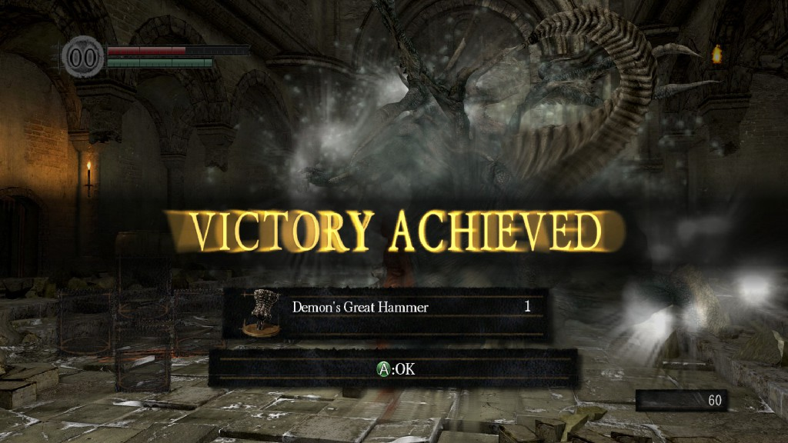

Either way, the Flame will inevitably fade to ash, and from ash, embers will glow and seek to re-establish a new Age of Fire, or—the third game suggests—perhaps something different, albeit temporary.

## Why the Absurd?

Approaching games according to the absurd is a way to confront the charge that games are meaningless or useless or a waste of time, but to do so on the game’s own terms rather than within the same system of values from which such a charge is raised. To respond to this in kind, for instance, someone may frame an MMO like *EVE: Online* or *Final Fantasy XIV* as a way to internalize the workflow, information networks, and labor management of contemporary capitalism.

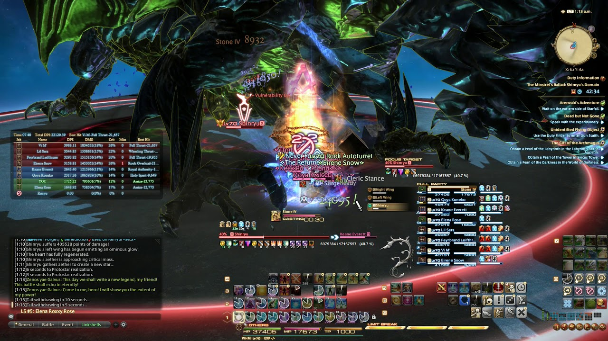

Or someone may claim that a game like *Super Mario Galaxy* exercises the player’s spatial reasoning and the experience of “flow.” 

These examples show how worth derives from the game’s relation to something extrinsic; the game plays the role of a subservient process.

The absurd, as a philosophic notion, removes this temptation to have recourse to an exterior meaning or value. Instead, I accept outright the utter meaninglessness of video games, and I bracket the typical rationales used to explain why we play them. Accordingly, the gamer must answer the question, “Why play a game at all?” with only the resources immanent to the process of gameplay.

In *The Myth of Sisyphus*, Albert Camus defines absurdity as the confrontation between, on one side, the human’s desire for unity and an overarching meaning for all life, and, on the other side, a cold, remorseless universe without reason, or at least without a rationality commensurable with humanism. Other players on the Souls subreddits and fan sites have already linked Dark Souls to absurdism and existentialism. In other games, as well, this outlook can be found. For example, one *Final Fantasy VII* player reached the maximum level, 99, in the opening area before the first boss. 

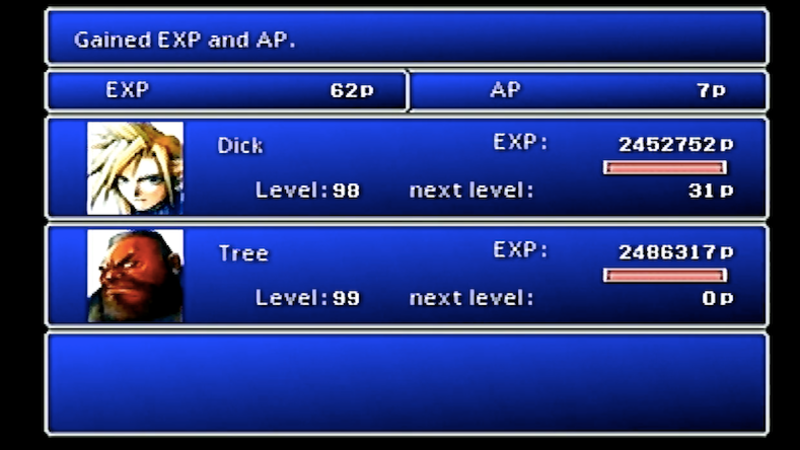

Apparently, the player, whose alias is “CirclMastr,” picked up this task after another player going by “Dick Tree” had lapsed in their own attempt. CirclMastr writes in a private blog post:


“Life does not have inherent meaning […] No matter how grand our achievements or how broad their scope, time turns all to dust and death destroys all memory. But that does not mean we cannot ascribe our own meaning to what we do. It is because nothing has meaning unto itself that we are free to create meaning, to make metaphor, and in doing so reflect on ourselves and our world.  
        “Leveling to 99 in the first reactor is pointless and meaningless. So why do I do it? I do it to express my hatred, and more importantly my disdain, for Dick Tree. I do it to express the camaraderie I feel for those of us who have followed this topic for years only to be disappointed by [Dick Tree]. I do it to prove to myself that I can persevere. The act is meaningless; I give it meaning.”


This statement is absurd both in the philosophic sense and in the more common sense of sounding ridiculous. It is also emblematic of Camus’s lesson on the absurd creator, which can now include the gamer: “to know that one’s creation has no future, to see one’s work destroyed in a day while being aware fundamentally that this has no more importance than building for centuries” (14). We can therefore think of all saved games as “the dogged revolt against [the player’s] condition, [as] perseverance in an effort considered sterile” (15).

## Absurdity of *Dark Souls*

As an anchor for the rest of the discussion, I have organized the remaining presentation around the *Dark Souls* motto: “Prepare to Die.” I consider in-game death as a point of superposition, as a theme and experience that is overdetermined by narrative, mechanics, and computational logic each in their own way, without exclusion. While I think such superposition is always the case when playing a computer game, and indeed when participating in any technical reality, in-game death in Dark Souls exemplifies how this overdetermined participation can be part of a video game’s fiction.

Let us first take up the experience of gameplay. As is so important for the absurd feeling in Camus’s *The Myth of Sisyphus*, the Souls games confront the player, at least at the start, with the “impotences” of human thought and knowledge (18). Which is to say, these games are really hard. For the vast majority of players, death is a nearly constant element of the game. Upon death, the character drops any accrued experience points, which are the “souls” they have collected, in a pool of blood at the site of death and they are returned to the bonfire at which they last rested. 

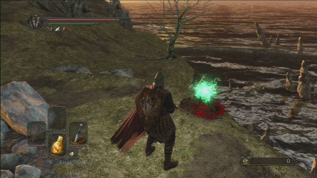

Like most video games, the game world also returns to its initial state. This sets the stage for a *Groundhog Day* sort of loop in which the player becomes accustomed, on one hand, to the possibility space and rhythms specific to that particular in-game region, and on the other hand, to the general mechanics operating throughout the game. 

The *Dark Souls* mantra that many fans repeat to frustrated newcomers complaining about the game’s difficulty is “git gud.” That is to say, the only way to cease feeling frustrated is to keep playing. While this no doubt often comes from a place of superiority, it nonetheless bears a kernel of absurdist truth: the proper way to live is in accordance with the world’s terms, all the while resisting the temptation of hope, that is, of belief in a transcendent meaning. Camus’s point is that an absurd life, the good life in a meaningless universe, rejects such transcending meaning all the while pursuing experience. 

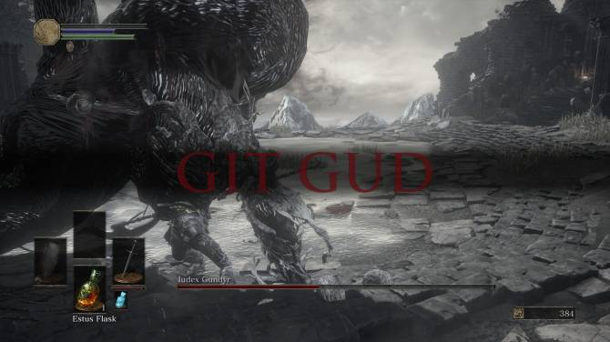

In games, the player must “live *solely* with what he [or she] knows, to accommodate him [ or her]self to what is, […] to live *without appeal*” (53). To “git gud” means to have renounced all appeal to forces beyond the game and, in the words of Camus, “to have accepted all the rules of the game” (74). Transposing Camus’s turn of phrase into the literal predicament of playing *Dark Souls*, note that the computer game has no rules, which would be the introduction of “unnecessary obstacles” that make the playful activity possible (Bernard Suits). Rather, a computer game has only the uncompromising mechanics of its code and the presentation of its game assets.

There is no “Game Over” in *Dark Souls*, and indeed, I follow the lead of Stephanie Boluk and Patrick LeMieux in arguing that “Game Over” is a cultural and economic imposition on games that misses the so much of hte potentail functioning of gameplay. For arcade cabinets, the requisite quarter or token that increases one’s “lives” or retries is itself programmed into the game’s operation. To help highlight why this is more than semantics, consider Jesper Juul’s 2013 book *The Art of Failure: An Essay on the Pain of Playing Video Games*. 

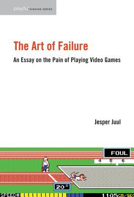

The subtitle suggests what is largely the case for the book: it is about the psychology of the player more than either games considered in and of themselves or than a capacious notion of gameplay in which game and player participate. In the same way that a glitch is not a failure of the program’s code, but rather its correct performance going against the user’s or designer’s expectations, so too is the player’s failure in fact the completely determined result of gameplay.

Juul speaks of a “threat of failure,” and writes, “Failure in games tells us that we are flawed and deficient” (30). My problem with this line of thinking is that it psychologizes gameplay to a degree that risks excluding the many other processes and perspectives involved. Identifying games as the art of failure, as what “allows us to experience and experiment with failure,” moreover suggests that play is primarily devoted to self-improvement. I maintain that, in games, there is no failure. Instead, failure is a second-order interpretation of the interactions which are foundational to habitualizing the player’s rational and causal grasp of the game’s design. Divergence in expected outcome from real outcome reveals not a limitation in the sense of imperfection or inadequacy, but rather an insight into power, in Spinoza’s sense of a capacity to affect and to be affected. This is because when a player supposedly fails, they nonetheless experience the game’s operation.

This is why I find it so salient that *Dark Souls* has a “You Died” screen rather than a “Game Over” screen. I also refuse to refer to the Souls games as “punishing,” although I recognize the rationale for doing so. A game with a quicker gameplay loop is, according to Juul, “less punishing” because it requires less waiting for the game to load or less repetition in that it begins again closer to the point of supposed failure (71).

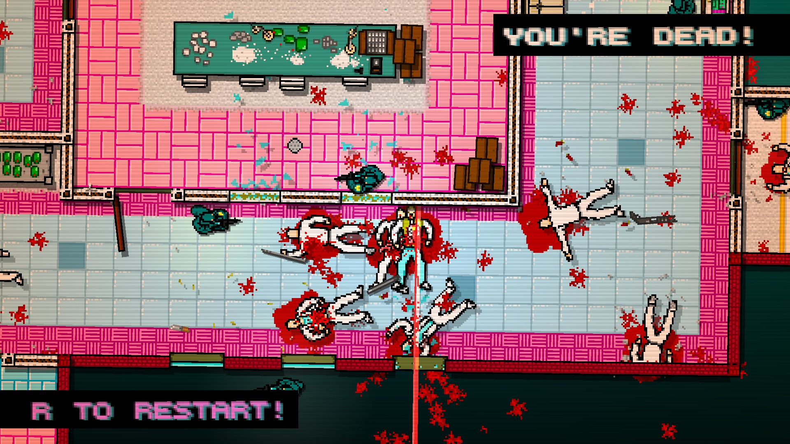

I disagree with framing in-game death as a “punishment[] for failure.” Like every other mechanic and parameter that composes the system, game death leads to the next step, the next structuration of the system’s potential for creating technical experiences. Even games with permadeath go back, or better, they go onwards, to the start screen for another individual playthrough.

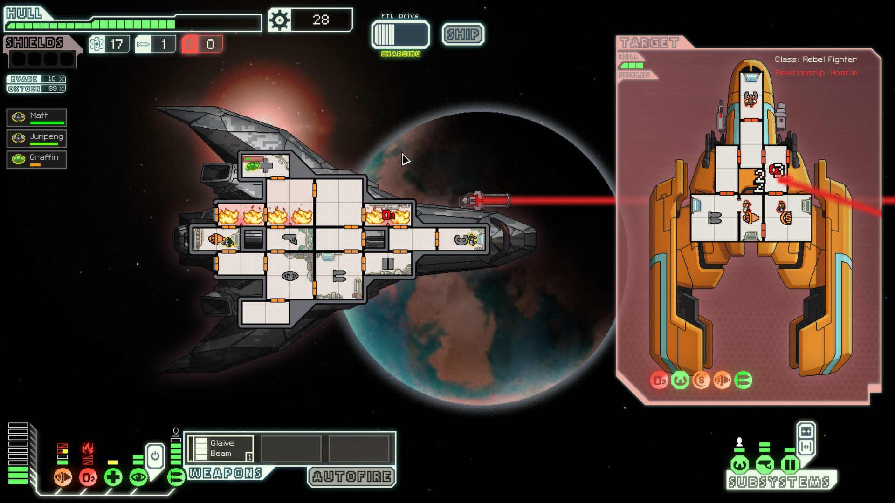

Camus writes that because death is “the only reality,” “I am not even free to perpetuate myself” (57). Likewise, the game must be thought in the context of its own end, its own death: turning it off, running out of electricity or time, hardware failure, software updates patching out its compatibility with drivers and the OS. By contrast, the moment of in-game death is something else. When the screen displays “You Died,” and the loading screen returns the player to a bonfire, this moment echoes the titular myth in Camus’s text, the moment that Camus asks us to view as joyful and not as punishment. 

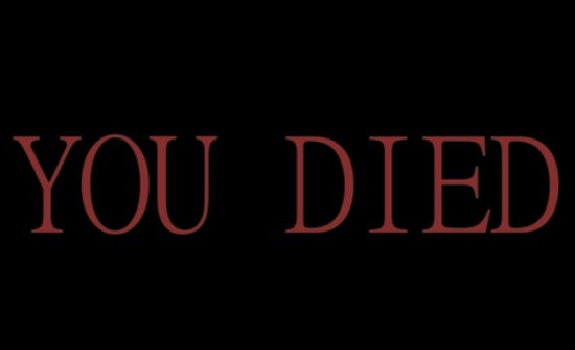

Every time that Sisyphus pushes his boulder to the top of the hill and pauses to watch it roll back down, “that is the hour of consciousness. At each of those moments […h]e is stronger than his rock” (121). Camus prefers to conceive of Sisyphus as happy with, not resentful of, his predicament. Sisyphus is thus emblematic of the joy of looking back and saying yes to one’s own fate in a silent, fatalistic universe (123). To die in *Dark Souls* and then to go on is likewise an hour of consciousness, a moment when the player may affirm their revolt against the intrinsic lack of greater purpose or meaning by which to frame the game.

## A Formal Joy

*Dark Souls* does away with a narrative pretense of completion or closure, opting instead to frame its recombinatory suite of performances in the player’s absurd confrontation with a lack of telos or final payoff. *Dark Souls* reflects this transience of meaning in its lore and thereby in how it refracts the inherited schemes of antecedent video games. In sum, the process of learning by trial and error, which is typically framed in terms of death or loss or an end, becomes an in-fiction cycle of the player’s undead character itself embedded in a worldly cycle of a mythic Flame burning out and reigniting. Playing its fiction, operating its program, generates a case of materiality in the precise sense N. Katherine Hayles gave to the term: 


materiality “is an emergent property created through dynamic interactions between physical characteristics and signifying strategies. Materiality thus marks a junction between physical reality and human intention."


And what exactly, in *Dark Souls*, resonates forth from physical media and interpreted signifier? A fractured impetus to keep playing—or, perhaps just as well, not.

The lore of *Dark Souls* straddles the distinction between mimesis and direct presentation. Like the explanatory power of classical myth, the series’ lore explains the operation of the game’s program. The seemingly endless cycle of an Age of Fire, its inevitable return to dark and, in turn, a return of embers to flame functions like a digital bedrock for the fiction of the gameplay: off and on, 0 and 1. Like the accrual of souls in-game that either end up in a pool of blood after death or are burned into the player character’s own soul, the computer game sediments its own cyclical happening in hardware memory by accessing game assets and registering changes. 

*Dark Souls* director and now From Software president Hidetaka Miyazaki said at a press conference for the third game:


“In Dark Souls 1, the player is set as the Undead because it describes the inheriting (or linking) of the fire. But in Dark Souls 3, not only do they, the Undead, become unsuccessful in becoming kindling, they also burn out after failing. The Unkindled is born out of the leftover ashes. The existence of the Unkindled can be said as inheriting the path of the past, using the accumulation of history as an ending.”


This accrual of past events culminates in the final boss of *Dark Souls 3*, which is the Soul of Cinder: a conglomerate of those characters (including players) to have linked the fire in previous games and previous cycles. 

As one plays a Souls game, other players can be periodically seen as ghostly figures walking around or resting at a bonfire. Their blood pools can be activated so that their final moments before death are played out. 

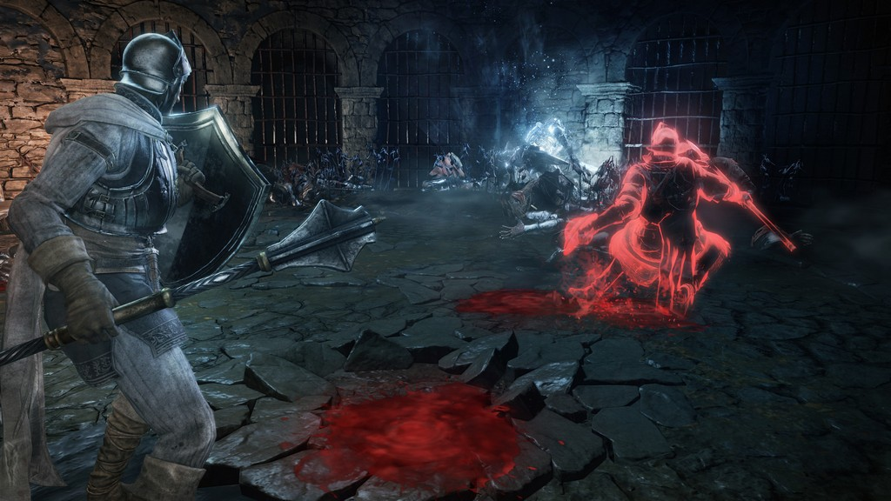

They may leave messages constructed out of a handful of prescribed terms and phrases such as “Praise the sun!” or “Trap ahead.”

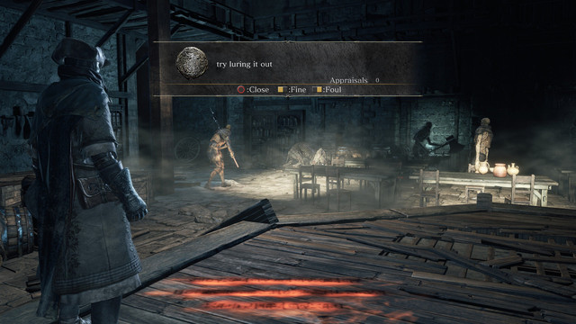

They may be summoned to another world to cooperate with a player, or they may invade and fight that world’s host player. Thus *Dark Souls* features both a cyclical repetition and a concurrent repetition or, as Shane Denson has argued, a contemporary take on Sartre's concept of seriality. While the former resonates with the computational structure of a game’s program, the latter is emblematic of parallel worlds constituting a common cyberspace. These enact what we might call, respectively, the temporality of causal efficacy and a server-based temporality.

Just as the data of past actions recur with every processor cycle, maintained in Random Access Memory and accessed in concert with the Read-Only Memory of the game’s program, so too is every playthrough compounded in the present and across the many presents of other players’ games. “The flow of time is distorted,” we read in the description of the White Soap Stone, an item that allows the player to travel to another player’s world. 

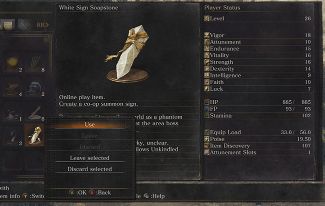

In-game narrative time conforms to the logic of multiplayer gameplay and of the single-player respawn loop. Every player death rehearses the past anew, and thereby accomplishes a novel run, adding it to the past.

Joy in Dark Souls therefore involves more than Sisyphus’s “hour of consciousness.” It is a formal joy like the one Eugenie Brinkema describes in *The Forms of the Affects*. Invoking the etymology of joy--—“gaudere (to rejoice)” and its doublet “gaudy” or the glittery happening on the surface of things--—Brinkema links joy’s form to the creative, but no less arbitrary, repetition of Nietzsche’s eternal recurrence. The past is arbitrary because it lacks intrinsic meaning, accepting this brute determinism is a potentially creative act because it provides the basis for the future. 

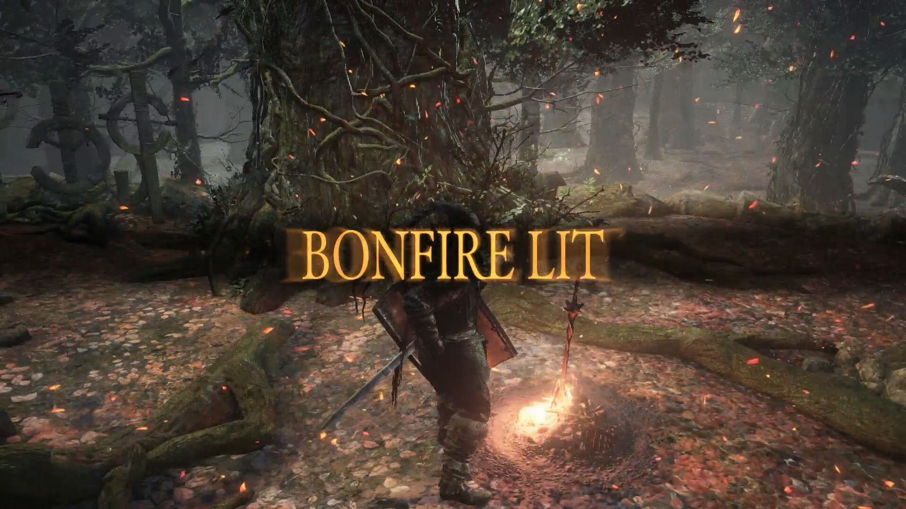

The formal structure of joy is therefore the same as the absurd’s embrace of all that is given. Each time a player dies, returns to a bonfire, and sets out again, they affirm the entire range of a game’s potential to generate experience, and to do so they also affirm the previous run, signified by the pool of souls previously obtained and lost at the site of the antecedent death. “Prepare to Die,” as both an attitude of play and a mechanic, speaks to how each previous run is not a failure, but rather a singular operation of the game’s potentiality. This repetition is arbitrary because it happens of its own accord without value attributed to any one playthrough over another and without meaning granted to the game on the whole by something that transcends it.

When *Dark Souls*’ apparent ending is reached, one either turns it off or starts a New Game+, in which the game world in its entirety is reset, with a higher difficulty, and the player’s character maintains their Soul Level. To play a computer game, then, is perhaps not unlike being Undead in *Dark Souls*. Keep cycling through and one is bound either to go hollow or to inherit the Flame and to begin again, and eventually each outcome serves as a seed for the other. 

The Emerald Herald tells the player in *Dark Souls 2* what is, I think, the only choice available in a game: “Once the fire is linked, souls will flourish anew and all of this will play out again. It is your choice: to embrace or renounce this.” In order to understand computer games in broader contexts, one must, I think, begin with this absurd problem. Its solution, as Camus instructs us, is to celebrate this struggle and to experience it for its own sake. Sisyphean software implicates the player’s resolve to struggle against an absence of ulterior purpose in the computer game’s technical superposition of temporally heterogeneous layers.

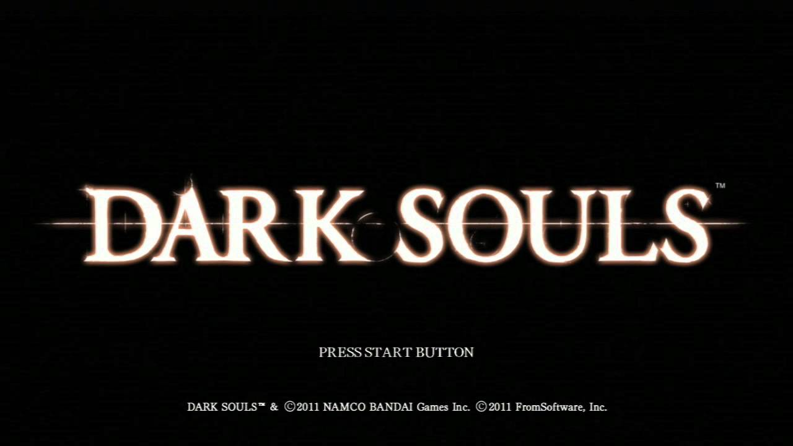